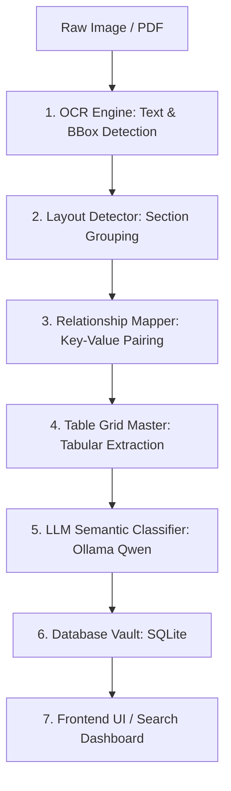

# 👁️ OCR & Document Intelligence System 🧠

An intelligent, full-stack, local-first document processing pipeline that transforms raw document images or PDFs into structured semantic database records. By combining computer vision-based layout analysis with local LLMs (Qwen), this system reads document pages and extracts key-value entities, structures tables, and infers semantic data types.

---

## 🚀 Key Features

*   **👁️ High-Precision Text Detection & Recognition (OCR):** Uses `PaddleOCR` and `OpenCV` to locate bounding boxes and extract text in multiple configurations (clean, scanned, multi-column, multilingual, camera snaps, and dense text).
*   **🗺️ Layout & Grouping Engine:** Analyzes document visual layout to group words into sentences and sections, preserving reading order and separating headers, footers, tables, and text bodies.
*   **🔗 Key-Value Matching:** Dynamically detects spatial associations to link keys (e.g., `GSTIN:`) with their values (e.g., `07AAACS0229G1ZR`).
*   **📊 Table Detection & Grid Extraction:** Protects and parses tabular data in line items (e.g., invoices, receipts) without mixing up columns.
*   **🕵️‍♂️ Semantic Identification:** Uses a local **Ollama** model (`Qwen2.5`) to identify the real-world identity of fields (e.g., classifying `"Rajbhar/Rohit"` as a `passenger_name`).
*   **🏦 Digital Vault:** Stores processed data safely in a local SQLite database for instant full-text searching and RAG (Retrieval-Augmented Generation) QA.
*   **🎮 Evaluation Dashboard:** Modern dark-mode dashboard (React + Tailwind CSS v4 + TypeScript) to view bounding boxes, run per-document OCR evaluations, inspect extraction metrics (CER, WER), and run custom queries.

---

## 📐 Architecture: The 7-Step Pipeline



1.  **Text Detection:** Scans images/PDFs and renders page images to extract bounding boxes.
2.  **Layout Analysis:** Reconstructs the page layout (headers, footers, reading order columns).
3.  **Key-Value Association:** Maps adjacent or vertical text blocks into key-value pairs.
4.  **Table Resolution:** Identifies grid boundaries and maps cells into structured JSON tables.
5.  **Semantic Classification:** Evaluates contexts through LLM prompts to normalize keys into canonical metadata.
6.  **Database Storage:** Indexes document text, tables, and metadata for queries.
7.  **Client Dashboard:** Displays layout bounding boxes, key-value mappings, tables, and search histories.

---

## 🛠️ Technology Stack

### Backend Engine
*   **Language:** Python 3.12+
*   **API Framework:** FastAPI & Uvicorn (REST API hosted at `http://localhost:8000`)
*   **Computer Vision & OCR:** PaddlePaddle, PaddleOCR 3.7.0, PyPDFium2, OpenCV
*   **Database:** SQLite3
*   **Local LLM Engine:** Ollama (`qwen2.5-coder:1.5b` or `qwen2.5-coder:7b`)

### Frontend UI Dashboard
*   **Framework:** React 19 (TypeScript)
*   **Build Tool:** Vite 8.0
*   **Styling:** Tailwind CSS v4
*   **Icons:** Lucide Icons

---

## 📁 Directory Structure

```text
OCR/
├── backend/
│   ├── app/
│   │   ├── api/                     # REST API Endpoints
│   │   ├── core/                    # App config & pipeline orchestrator
│   │   ├── document_intelligence/   # Layout, key-value, and table processing engines
│   │   ├── input/                   # PDF, DOCX, and Image loading layers
│   │   ├── intelligence/            # Ollama client and prompt templates
│   │   ├── services/                # Database connection & evaluation services
│   │   └── main.py                  # API entrance script
│   └── requirements.txt             # Python dependencies
├── frontend/
│   ├── src/                         # React components, styles, types, and layouts
│   ├── package.json                 # Node packages
│   └── vite.config.ts               # Vite bundler configuration
├── test-data/                       # Local evaluation dataset folders
├── tests/                           # Automated Python unit test suite
├── start_network.bat                # Unified launcher for both servers
└── README.md                        # Documentation
```

---

## 🚀 Setup & Installation

### Prerequisites
*   [Python 3.12+](https://www.python.org/downloads/)
*   [Node.js (v18+)](https://nodejs.org/)
*   [Ollama](https://ollama.com/) (For local LLM document understanding)

### 1. Ollama (LLM Setup)
Make sure Ollama is installed and running, then pull the model you wish to use:

```bash
# Recommended for CPU-only systems (faster generation):
ollama pull qwen2.5-coder:1.5b

# Recommended for GPU accelerated systems (higher accuracy):
ollama pull qwen2.5-coder:7b
```

### 2. Backend Setup
1. Navigate to the project root and create a virtual environment:
   ```bash
   python -m venv venv
   ```
2. Activate the virtual environment:
   *   **Windows (cmd):** `.\venv\Scripts\activate`
   *   **Windows (PowerShell):** `.\venv\Scripts\activate.ps1`
   *   **macOS/Linux:** `source venv/bin/activate`
3. Install dependencies:
   ```bash
   pip install -r backend/requirements.txt
   ```

### 3. Frontend Setup
1. Navigate to the frontend directory:
   ```bash
   cd frontend
   ```
2. Install npm packages:
   ```bash
   npm install
   ```

---

## 🎮 How to Run

You can run both the frontend and backend simultaneously using the provided batch script.

### Using the Unified Network Launcher (Windows)
Run the script in the project root:
```bash
.\start_network.bat
```
This automatically:
1. Detects your local machine's IP address.
2. Starts the **FastAPI Backend** on port `8000`.
3. Starts the **React Frontend** on port `5173`.
4. Opens the app on any device on your Wi-Fi at `http://<your-local-ip>:5173`.

### Running Separately (Manual Command Line)
*   **Start Backend:**
    ```bash
    set PYTHONPATH=backend
    set OLLAMA_MODEL=qwen2.5-coder:1.5b
    python -m uvicorn app.main:app --host 0.0.0.0 --port 8000
    ```
*   **Start Frontend:**
    ```bash
    cd frontend
    npm run dev
    ```

---

## 🧪 Testing & Evaluation

### Automated Unit Tests
The backend features an isolated, lightweight `pytest` suite that uses synthetic mock data (no LLM connection required). To run tests:
```bash
python -m pytest tests/
```

### Interactive Dataset Evaluation
Place validation documents under subfolders in `test-data/`:
1. Support formats include `.png`, `.jpg`, `.jpeg`, `.webp`, and `.pdf`.
2. Add a matching `.txt` file containing the ground truth text (e.g., `invoice_01.txt` next to `invoice_01.png`).
3. Open the **Category Browser** in the Web UI, select your sample, and run the pipeline. The system will automatically calculate and render the **Character Error Rate (CER)** and **Word Error Rate (WER)** metrics.

---

## 🛠️ Troubleshooting

### Address Already in Use (`[Errno 10048]`)
If the backend crashes with a socket bind error on port `8000`, a background instance of Python/Uvicorn is likely running. Kill it using PowerShell:
```powershell
taskkill /IM python.exe /F
```

### Extremely Slow Processing Times
If query processing or document analysis is taking over 30 seconds:
1. Run `ollama ps` to verify if the model is loading onto CPU.
2. If running on CPU, make sure you configure your system to use the **`qwen2.5-coder:1.5b`** model instead of `7b`.
3. Check that your GPU is supported and correct NVIDIA CUDA drivers are installed to enable GPU acceleration in Ollama.
